# Comic Studio

**An experiment in collaborative AI workflows for comic book creation.**

Comic Studio explores what happens when AI isn't a tool you operate but a peer you co-create with. There are no "generate" buttons wired to rigid templates. Instead, every interaction happens through natural conversation with context-aware AI agents that understand where you are in the creative process and what tools are relevant.

The AI is another voice in the room — not a sycophant that agrees with everything, not a steamroller that takes over. It's a collaborator that can brainstorm story ideas, draft dialogue, generate character art, and push back on creative choices when something isn't working. The creator stays in control, but the AI has a real seat at the table.

<p align="center">
  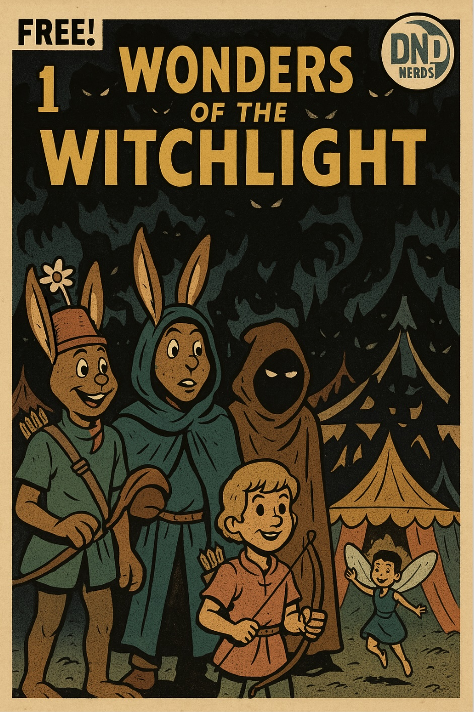
  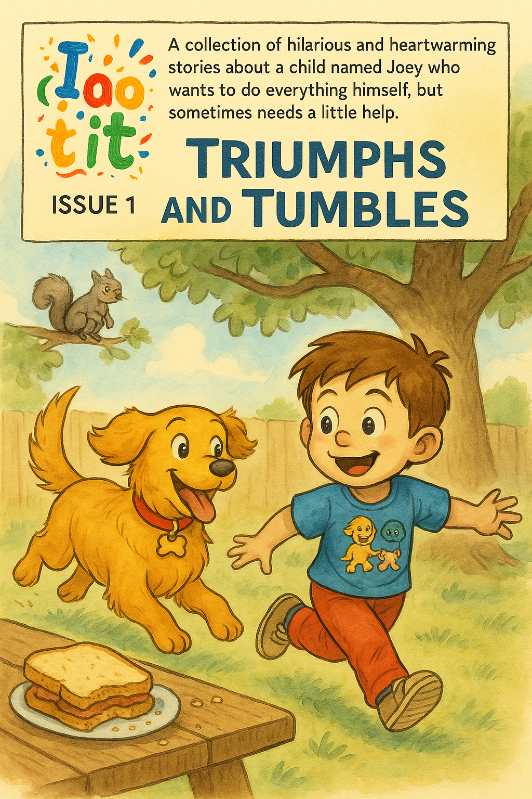
</p>
<p align="center"><em>Fully AI-generated comic covers, created through conversation — not forms.</em></p>

---

## Why This Exists

Most creative tools treat AI as a feature bolted onto a traditional interface: click a button, get an output, copy-paste it somewhere. The creator tosses a request over the wall and hopes something useful comes back. That's not collaboration — that's a vending machine.

Comic Studio is an experiment in a different model. The AI is a co-creator with its own perspective:

- **No wired buttons.** Creation, editing, and rendering all flow through natural language. There's no "Generate" button — you talk to the AI the way you'd talk to a collaborator sitting next to you.
- **Co-creation, not handoff.** The AI doesn't generate assets for you to drag into a separate editor. You work together in a shared workspace where story structure, character data, style references, and generated art all live side by side.
- **A peer, not a servant.** The AI can push back, suggest alternatives, and challenge choices that aren't working. No sycophancy, no steamrolling — just another voice in the room with useful skills.
- **Context-aware agents.** The system dynamically selects from 14 specialized agents based on what you're working on. Editing a panel? The agent already knows the scene, the characters in frame, the art style, and the dialogue. It doesn't ask you to re-explain.

---

## What It Produces

Comic Studio manages the full creative hierarchy — from series bible to individual panel — and generates imagery that maintains visual consistency across an entire issue.

### Style System

Define an art style once and apply it everywhere. The system supports separate style definitions for art, characters, and dialogue elements (speech bubbles, thought bubbles, sound effects, narration boxes). Generate style examples as visual anchors before committing to a look.

<p align="center">
  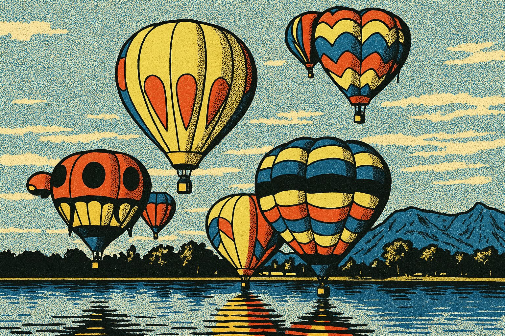
  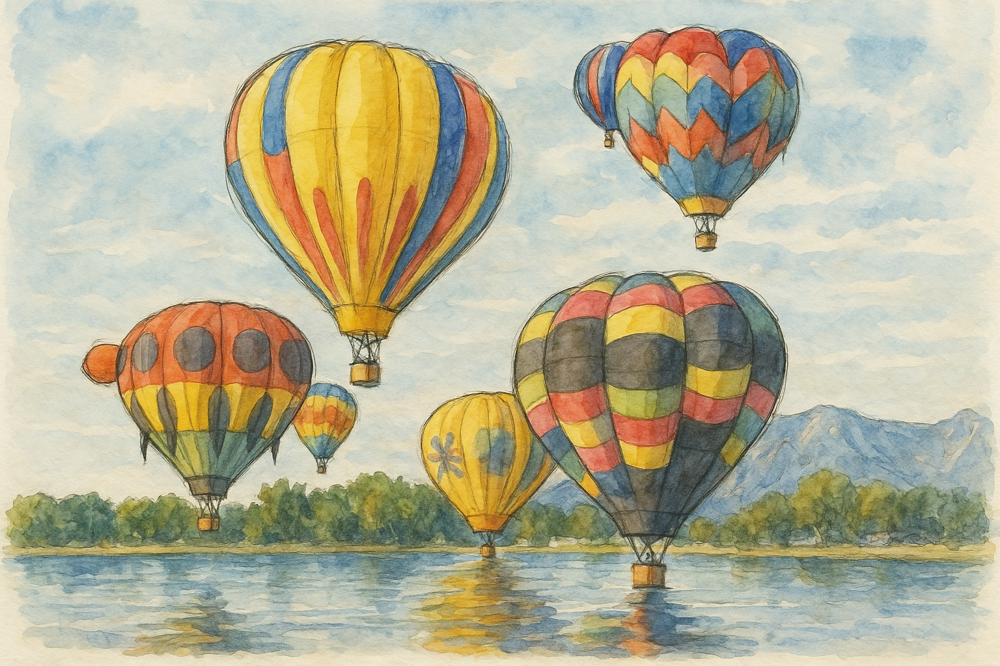
  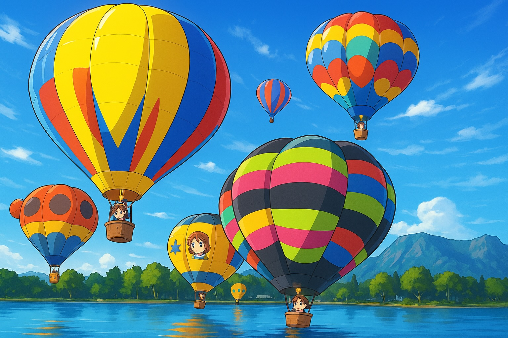
</p>
<p align="center"><em>The same scene prompt rendered across three different art styles.</em></p>

### Character Consistency

Characters are defined with structured appearance, attire, and behavior descriptions. Each character can have multiple variants (costumes, ages, disguises), and every variant can be rendered as a style reference sheet with turnarounds and expression studies.

<p align="center">
  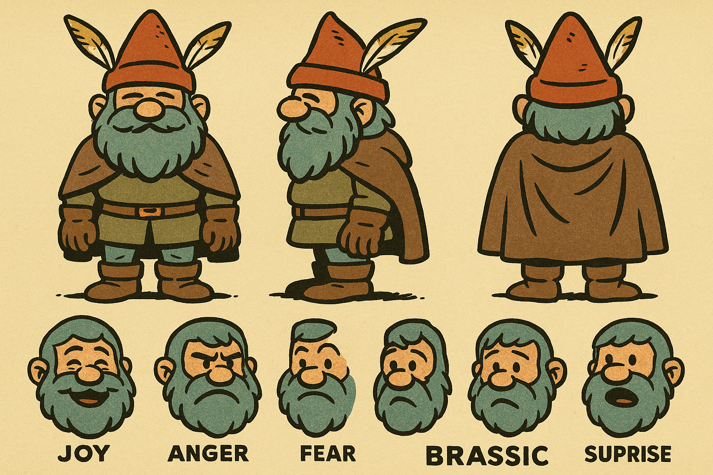
  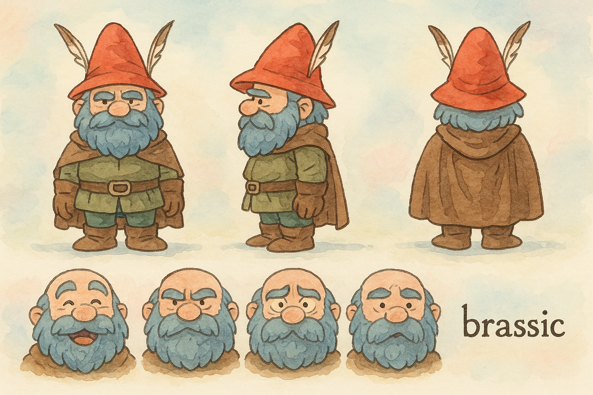
  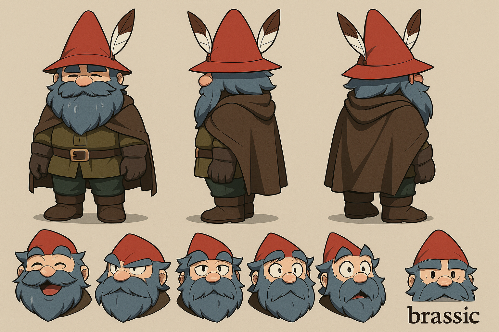
</p>
<p align="center"><em>The same character variant — "Brassic in gnome disguise" — rendered consistently across three art styles with turnaround poses and expression studies.</em></p>

### Dialog Styles

Each comic style includes distinct visual treatments for different dialog types — normal speech, whispers, shouts, thoughts, narration, and sound effects — generated as reference examples to lock in the visual language.

<p align="center">
  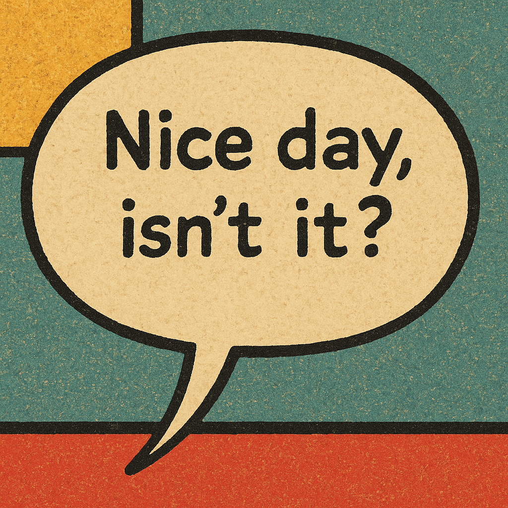
  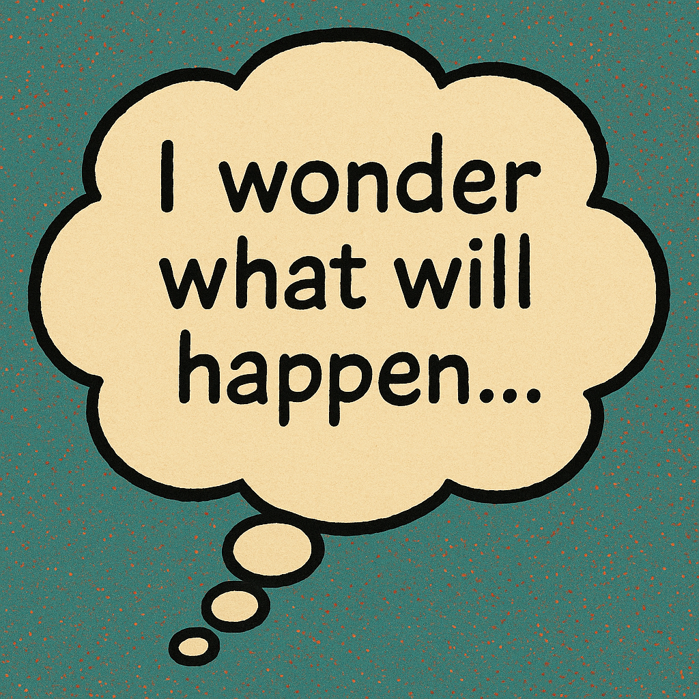
  
</p>
<p align="center"><em>Dialog style examples: chat, thought, and shout bubbles in vintage four-color.</em></p>

---

## Architecture

### AI-First Design

The application is built on the **OpenAI Agents SDK** with function-calling tools, not a simple chat wrapper. Each of the 14 agent types has:

- A **custom persona** with system instructions tailored to its role (story editor, character designer, cover artist, etc.)
- A **filtered toolkit** — only the tools relevant to the current context are available, preventing hallucinated actions
- **Full object context** — the agent receives the current selection's data, parent hierarchy, and related assets as structured context

This means you can say *"make the dialogue punchier"* while viewing a panel, and the agent knows exactly which panel, which scene it belongs to, what characters are in frame, and what the art style is — without you specifying any of it.

### 60+ Function Tools

Tools cover the full CRUD lifecycle plus specialized creative operations:

| Category | Examples |
|----------|----------|
| **Story** | Create/edit series, issues, scenes, panels, dialogue, narration |
| **Characters** | Create characters, define variants, manage appearance/attire/behavior |
| **Visual** | Generate panel images, covers, character reference sheets, style examples |
| **Editing** | Inpainting, outpainting, region-based image editing with conversational steering |
| **Style** | Define art/character/dialog styles, generate visual anchors |
| **Navigation** | Context-aware selection changes through the data hierarchy |

### Studio Workspace UI

Built with **NiceGUI** (Python web framework), the interface follows a studio layout:

- **Breadcrumb navigation** through the creative hierarchy (Series > Issue > Scene > Panel)
- **Split view** — structured data editing on the left, AI conversation on the right
- **Image grids** with render, select, and delete for managing generated assets
- **Reference image uploads** to guide AI generation with visual context
- **Voice input/output** — dictate instructions and hear AI responses
- **Dark mode** with consistent theming

<p align="center">
  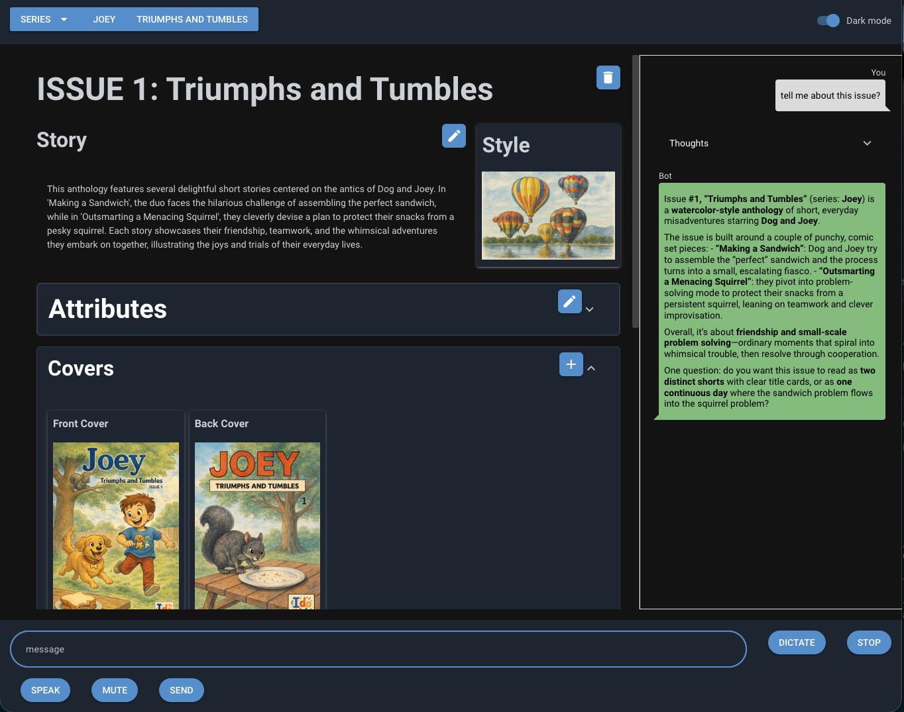
</p>
<p align="center"><em>The studio workspace: structured editing on the left, AI conversation on the right.</em></p>

---

## Data Model

```
Publisher (brand, logo)
  └─ Series (premise, description)
       ├─ Characters
       │    └─ Variants (appearance, attire, behavior)
       │         └─ Styled Reference Images
       ├─ Issues (story, metadata, credits)
       │    ├─ Scenes (narrative, setting, style)
       │    │    └─ Panels (beat, description, dialogue, narration, aspect ratio, images)
       │    └─ Covers (description, character refs, images)
       └─ Comic Styles
            ├─ Art Style (linework, inking, color palette)
            ├─ Character Style (form, proportions)
            └─ Dialog Styles (bubble types, typography, effects)
```

Every entity is a Pydantic model with full validation. The hierarchy is navigable in the UI and understood by the AI agents.

---

## Tech Stack

| Layer | Technology |
|-------|-----------|
| **Language** | Python 3.12+ |
| **UI Framework** | NiceGUI 2.19+ |
| **AI Orchestration** | OpenAI Agents SDK |
| **LLM** | GPT-5.2 (text generation, function calling) |
| **Image Generation** | gpt-image-1.5 (generation, inpainting, outpainting) |
| **Data Validation** | Pydantic 2.11+ |
| **Image Processing** | Pillow 11.2+ |
| **Storage** | Local JSON with abstract storage interface |
| **Logging** | Loguru |

---

## Creative Workflow

1. **Define your style** — Create a comic style with art, character, and dialog parameters. Generate visual examples to lock in the look.
2. **Build your cast** — Create characters with variants (costumes, ages, forms). Generate styled reference sheets for visual consistency.
3. **Write your story** — Create a series and issue. Collaborate with the AI to develop the story summary.
4. **Break it down** — Divide the issue into scenes with narrative summaries. The AI can suggest scene breaks from your story.
5. **Panel by panel** — Define each panel's beat, visual description, dialogue, and narration. The AI drafts from scene context.
6. **Generate art** — Render panel images and covers. The system builds prompts from structured data: character descriptions, scene context, style parameters, and reference images.
7. **Refine** — Use conversational image editing (inpainting/outpainting) to adjust generated art. Select finals from the image grid.

Every step is conversational. You're never filling out a form — you're talking to a collaborator who happens to have a structured understanding of your entire project.

---

## Getting Started

```bash
# Clone the repository
git clone <repo-url>
cd comics

# Create a virtual environment
python3 -m venv .venv
source .venv/bin/activate

# Install dependencies
pip install -r requirements.txt

# Set your OpenAI API key
echo "OPENAI_API_KEY=your-key-here" > .env

# Run the application
python main.py
```

The app launches a local web server (default: http://localhost:8080).

---

## Key Design Decisions

- **Conversation over configuration.** Every creative action flows through the chat. This isn't laziness — it's a deliberate choice to keep the creator in a flow state rather than switching between forms and menus.
- **Agents over endpoints.** Instead of REST APIs behind buttons, the system uses function-calling agents that reason about which tools to invoke based on natural language input and current context.
- **Style as a first-class entity.** Styles aren't filters applied after the fact. They're structured definitions (art, character, dialog) that propagate through every generation call, ensuring visual coherence across an entire series.
- **Reference images as creative guardrails.** Uploaded references and generated style examples are fed into every image generation call, giving the AI visual context alongside textual descriptions.

---

## Project Status

This is an active experiment in AI-first application design and collaborative creative workflows. The core loop — from series creation through panel image generation — is functional and producing real output. It's not production software; it's a working exploration of what co-creation with AI can look like when the AI is treated as a peer rather than a tool.

---

## License

All rights reserved.
