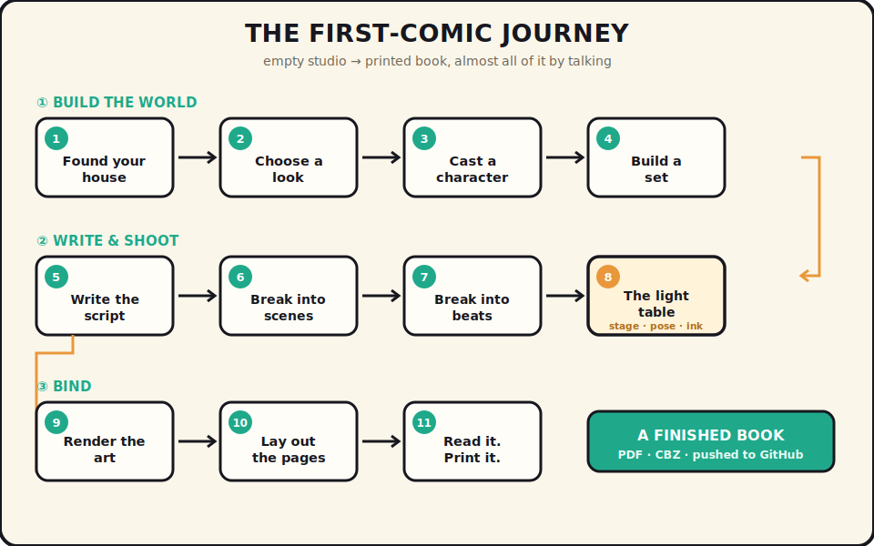
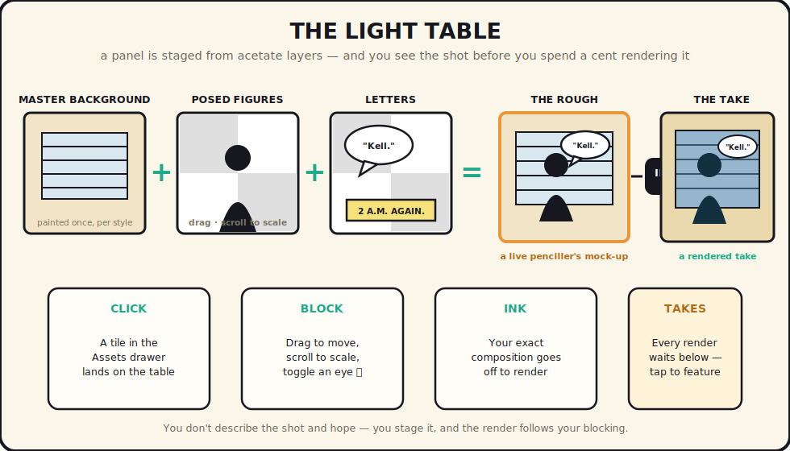
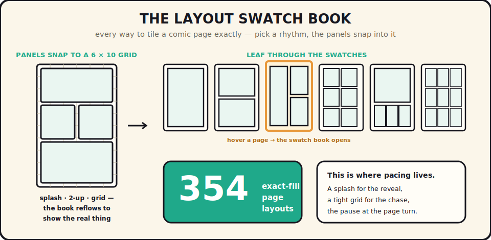

# Making Your First Comic

Welcome to the studio.

You've installed Comic Studio and it's open in your browser at `http://localhost:8080`. What's in front of you isn't a form to fill out — it's a room to work in, with a collaborator already in it. This guide is a walk through your first session together, from the empty studio to a finished, printed comic. We'll make a short one, end to end. Every step is real; follow along in your own studio as you read.

One promise before we start, so you can relax and experiment: **nothing you make here is ever truly lost.** Delete something and it goes to the wastebasket, not the void. So poke at things. Try the wrong thing on purpose. You can always come back.

Here's the whole journey on one page. We'll walk it together, panel by panel.

<p align="center">
  
</p>

---

## A quick look around the room

The studio is one room, split down the middle.

- On the **left** is whatever you're working on — right now, the lobby. This side always shows the *thing*: a character, a scene, a page.
- On the **right** is the **coauthor** — your collaborator. You don't operate this software so much as *talk to it*. There are no "Generate" buttons. You ask, and things happen.

<p align="center">
  
</p>
<p align="center"><em>The whole studio: what you're working on at left, your collaborator at right.</em></p>

Notice that the coauthor speaks first. Every place you go, it opens with a line about where you are and what's worth doing next, and offers a few **chips** — little suggestions you can tap to start. Tap one and it says that thing for you; or just type in the box at the bottom and talk.

A few landmarks you'll use constantly:

- The **breadcrumb** across the top is your trail: *Series › Issue › Scene › Panel*. The very first crumb is a door — tap its arrow to step between the studio's four rooms: **Publishers**, **Series**, **Styles**, and the **Library**.
- **`Cmd`/`Ctrl-K`** opens the **command palette** — start typing the name of anything in your studio and jump straight to it. Can't find a match? Whatever you typed becomes a question to the coauthor. It's the fastest way to get anywhere.
- Up in the header sits a **wastebasket** (everything you've deleted, one click from coming back) and a small **spend meter** (today's renders and roughly what they cost — image generation isn't free, and the studio keeps you honest about it).

That's the whole room. Let's put something in it.

---

## Step 1 — Found your house

In Comic Studio, everything you create lives inside a **publishing house** — your imprint. A house isn't a folder buried in the app; it's *your* project, a self-contained git repository that belongs to you. Your styles, your cast, your issues — all of it lives in the house, kept cleanly apart from the app itself.

Open the first-crumb door and step into **Publishers**. If this is a fresh studio, it's empty. Let's fix that.

Choose **found a house**, give it a name — say *Midnight Press* — and pick a folder for it to live in. The studio does the rest in one motion: it scaffolds the repository, copies in a starter set of styles, prompts, and references so you're not staring at a blank page, writes your publisher's record, and makes the **founding commit**. Your house is now a real git repo with its first commit already in it.

From this moment on, Midnight Press is your open house. Everything you make belongs to it.

> **Already have a house?** Maybe a teammate shared one, or you're returning to a project on a new machine. Instead of founding, point the studio at the existing repo on disk and it recognizes it — same styles, same cast, right where you left them. You add a project simply by *linking it in*.

---

## Step 2 — Put your house on GitHub *(optional, but do it)*

Because your house is just a git repository, keeping it safe and sharing it is ordinary git — the studio doesn't reinvent any of that. In a terminal, in your house's folder:

```bash
git remote add origin git@github.com:you/midnight-press.git
git push -u origin main
```

That's it — your comic is backed up and shareable. Bring it to another machine with `git clone`, then link it in from the Publishers room (Step 1).

The studio was thoughtful about what to sync: your creative work — records and finished art — goes to GitHub, while local scratch (the wastebasket, the render queue, exported PDFs, the spend log) is kept out of history automatically. You push the comic, not the sawdust.

As you work, commit whenever you'd like a save point: `git add -A && git commit -m "first scene blocked out"`. The studio never touches your history after founding — that's yours to keep.

---

## Step 3 — Choose a look

A comic needs a look before it needs art, so that every panel comes out of the same world. Step through the first-crumb door into **Styles**.

Your house came with a few starter styles. Open one and you'll see it's really three styles working together: an **art style** (linework, inking, palette), a **character style** (proportions, the way faces are drawn), and a set of **dialog styles** — six kinds of lettering: normal speech, whisper, shout, thought, sound-effect, and narration.

You can adopt a starter as-is, or make your own. To make one, just ask:

> **You:** Create a new style — moody neo-noir, heavy blacks, a single sickly green spot color, hand-lettered captions.

The coauthor builds it. Then, before you commit, see it:

> **You:** Show me a few style examples.

It renders sample art in that style so you can judge the look with your eyes, not your imagination. Nudge it — *"less green, more rain"* — until it's right. This is the anchor everything else hangs on, so it's worth a minute.

<p align="center">
  
  
  
</p>
<p align="center"><em>One scene, three different styles. Whatever you choose here flows into every panel you'll draw.</em></p>

Part of the style is how it *letters* — six distinct treatments so a whisper never looks like a scream:

<p align="center">
  
  
  
</p>
<p align="center"><em>Dialog styles — normal speech, thought, shout (plus whisper, sound-effect, and narration).</em></p>

---

## Step 4 — Cast a character

Head through the door into **Series** and make one:

> **You:** Start a new series — *The Long Way Down*, a rain-soaked detective story.

Open your new series and meet your lead. A **character** is the idea of a person; a **variant** is a specific *look* — an age, a costume, a disguise. You draw variants, not characters, and that's the secret to consistency.

> **You:** Create a character named Vera Kell, a tired private investigator. Give her a variant: late forties, long grey coat, sharp eyes.

Now the important part — the thing that keeps Vera looking like Vera in every panel:

> **You:** Render her reference sheet.

The studio generates a **model sheet** for that variant in your style — turnarounds and expressions, a single source of truth for how she looks. From here on, whenever Vera appears in a panel, the studio hands her sheet to the renderer as a reference. That's why panel 3 and panel 9 show the same woman.

<p align="center">
  
  
  
</p>
<p align="center"><em>The same character variant, held consistent across three styles — turnarounds and expressions. This is what a reference sheet buys you.</em></p>

Reusable wardrobe and props work the same way — an **outfit** or a **prop** you build once and dress your cast in — but for a first comic, one character and one variant is plenty. Keep moving.

---

## Step 5 — Build a set

Characters need somewhere to stand. A **setting** is a reusable place — an office, an alley, a diner at 2 a.m. — described richly enough that it comes out the same every time you shoot in it.

> **You:** Create a setting: Vera's office. Cramped, venetian blinds, a bottle in the drawer, neon bleeding through the window.

Then render its anchor:

> **You:** Render the master background for this setting.

This **master background** is the magic behind "composition all the way down." It's painted *once*, per style. Every panel set in Vera's office is then built *on top of* this exact background — so the blinds, the desk, the neon are identical from panel to panel without you ever describing them again. Build the set once; shoot in it forever.

---

## Step 6 — Write the script

Now the story. Go into your series and start an **issue** — issue #1. An issue holds the **script**: you can write it here with the Editor, or paste in something you already have.

> **You:** Here's my story for issue one. *(paste your draft)*

Talk it over. The coauthor is an editor, not a stenographer — it will ask questions, suggest a stronger open, push back if the ending doesn't land. Go a few rounds. When the script feels right, you're ready to turn prose into pictures.

---

## Step 7 — Break it into scenes

This is where the comic starts to take shape. Ask the studio to do the first pass of the hardest job:

> **You:** Break this story into scenes.

The Editor reads your script and lays out the scenes — each one a beat of the story with a place and a purpose. Open one and you're standing in the studio's **beat board** for that scene. It shows you, at a glance, what the scene still needs:

- A **setting** — tap the amber *setting* chip and pick "Vera's office" from the little rack of your sets (or ask for a brand-new one).
- A **cast** — tap *cast* and tell the coauthor who's in this scene. Vera's chip appears, wearing her name.
- The **story** of the scene, editable right there.
- Quiet production notes — **time of day**, **mood**, **blocking** (where people stand and how the shot moves).

Anything missing shows as an amber pill you can tap to fix; anything set shows as a solid chip you can click to visit or remove. When a scene has its place, its people, and its beats, it's ready to shoot.

---

## Step 8 — Break a scene into beats

A scene is made of **panels** — the individual frames, the *beats* of the moment. Let the studio rough them in:

> **You:** Break this scene into panels.

The coauthor proposes the beats — a wide establishing shot, a push-in on Vera's face, the phone ringing — each with a description and any dialogue, drafted from the scene you just set up. A chip appears: **"3 panels — read them in the book."** Tap it, and you're inside **the open book**.

The book *is* your comic — real spreads, lying open on the table, that you read and edit in place. A **detail dial** in the masthead lets you read at three altitudes: **stories**, **scenes**, or **beats**. Right now you're at *beats*, watching your panels flow across the pages. Reorder a beat with `‹ ›`, edit any line with `✏️`, cut one with `✕`. The book reflows as you go.

Tap into a single beat and you arrive at the workbench — the light table.

---

## Step 9 — Stage a panel on the light table

This is the heart of the studio, and the part that feels most like magic.

A panel isn't one wish typed into a box. It's **staged** from parts, like an animator's light table — transparent acetates stacked in comic-craft order: **letters over foreground over figures over background.**

<p align="center">
  
</p>

Here's what's in front of you:

- At the top, the **script** — the one line the whole render grows from.
- On the left, the **stack** — every layer in the panel, each with an **eye** you can toggle to lift its acetate off the table.
- On the right, the **rough** — a live penciller's mock-up, assembled from the parts in real time, so you see the shot *before* you spend a cent rendering it.

To stage the shot, open the **Assets** drawer from the header (it appears whenever you're on a panel or cover). It's a contact sheet of everything reusable in your house — characters, settings, props, styles. **Click a tile and it lands on the table:** click Vera and she steps onto the stage; click Vera's office and the master background drops in behind her.

Now block the shot with your hands:

- **Drag** a figure to move her across the frame.
- **Scroll** on her to scale her up or down — closer or further, a shot with depth.
- **Toggle an eye** to lift a layer out of the shot, or reorder the stack to change who's in front.

Move Vera to the left third, scale her large for a tight, tense framing, and let the office breathe behind her. When the rough looks like the panel you want, do the one thing the whole table is built for:

> **Ink the rough.**

That sends your exact composition — background, posed figures, letters, and all — to the coauthor to render as a real take. You didn't describe the shot in words and hope. You *staged* it, and the render follows your blocking.

---

## Step 10 — Render the art

Ask for the take (inking the rough does this; you can also just say *"render this panel"*). The render runs in the **background queue** — the studio doesn't freeze while it paints. You can keep working on the next beat, and when the art lands it drops right into the conversation with a little receipt. Watch the **spend meter** tick up in the header so there are never any surprises.

Every render is a **take**. They line up in the **takes row** beneath the table — tap any one to make it the featured print. Not quite right? You have options, all conversational:

- **Render another take** and compare.
- Open a take in the **image editor** and fix just one region — *"clean up her left hand," "add rain on the window"* — with inpainting and outpainting, no need to redo the whole panel.
- **Rework a take on the table** — drop the render back as a background layer and stage a new pass over it.

Unpicked takes aren't thrown away — they wait in the wastebasket in case you change your mind. When Vera's office panel looks right, feature it and move on. Do the same for the rest of the scene — or just say **"render the missing panels"** and let the studio work through the batch while you get coffee.

---

## Step 11 — Lay out the pages

You have panels; now you build **pages**. Back in the open book, each page carries a hidden door — hover it and the **layout swatch book** swings open.

<p align="center">
  
</p>

Think of it as a printer's book of blank page layouts. The studio has worked out **every** way to tile a comic page exactly — **354 layouts** in all, from a full-bleed splash to a tight nine-up grid — and here they are as little inked thumbnails. Pick one, and the studio binds this page's panels into it: a splash gets the whole page, a quiet exchange gets a neat 2-up, a chase gets a busy grid. The book reflows to show you the real thing.

This is where pacing lives — the pause at the bottom of a page, the reveal on the turn. Leaf through the swatches until the rhythm feels right.

---

## Step 12 — Read it. Print it.

You made a comic. Go read it.

The studio has a **reading room** — the bound issue held open in your hands, two pages to a spread, the cover alone up front, arrow keys to turn the page. No editing tools, no chat, just your book. And here's the quiet guarantee: what you read is composed with the *exact same math* that binds the print file. **What you read is the book.**

And it opens on its cover — the first thing a reader sees, made the same way everything else was:

<p align="center">
  
  
</p>
<p align="center"><em>Covers, bound and ready — trade dress, title, and all, composed through conversation.</em></p>

When you're ready to send it out into the world, export it:

> **You:** Export this issue as a PDF.

The studio binds a print-trim PDF at proper comic dimensions — front cover, indicia, your pages with folios, back cover. Want it for a comics reader instead? Ask for a **CBZ**. Both land in your issue's exports, downloadable right from the reading room's masthead. If anything's still missing — an unrendered panel, a panel not yet placed on a page — the studio tells you exactly what stands between you and press, so nothing ships half-drawn.

Then commit and push, and your first issue is safe on GitHub:

```bash
git add -A && git commit -m "issue one — to press" && git push
```

---

## That's the whole loop

Look at what you just did: founded an imprint, dressed a world, wrote a script, staged and rendered real artwork, laid out pages, and printed a book — and you did almost all of it by *talking*. That's the whole idea. The structure — every character, setting, style, and page — is understood by the studio, so you never have to re-explain yourself. You stay in the story; the studio handles the bookkeeping.

A few things to carry with you as you make the next one:

- **When in doubt, ask.** The coauthor knows exactly where you are and what's around you. *"What's this scene missing?" "Give me three ideas for the cover." "Make her dialogue punchier."* It's a collaborator, not a menu.
- **Nothing is lost.** Deleted a panel you wanted back? The wastebasket has it. The only permanent delete is a 30-day cleanup, and it always asks first.
- **Every view is a place you can link to.** Copy the URL of any panel and it'll open right there next time — reload-safe, shareable, and each one remembers its own conversation.
- **Commit often.** Your house is a git repo. Save points cost nothing and let you experiment fearlessly.

Now go make the next issue. The studio's ready when you are.
