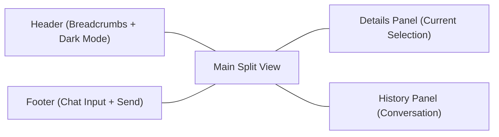
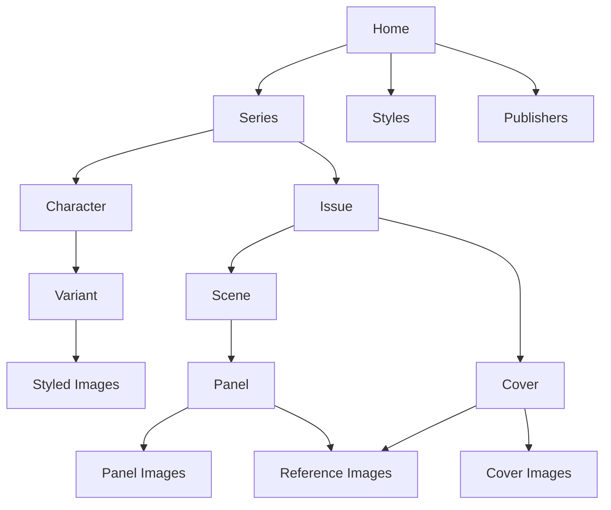

# Vision

Build a creator‑first comic production workspace where writers and artists can develop a series end‑to‑end: worldbuilding, characters, issues, scenes, panels, and final imagery, with AI assistance that accelerates iteration without removing creative control. The AI is another voice in the room—a collaborator that can brainstorm and a critic that can challenge choices when useful.

## What We Are Building

A single workspace that blends:
- Structured story data (series → issues → scenes → panels).
- Visual systems (styles, character variants, reference images).
- AI tools for drafting, refinement, and image generation.
- A visual UI for browsing, editing, and selecting assets.

The goal is to make comic creation feel like a studio workflow—organized, iterative, and fast—while preserving the creator’s voice and decisions.

## Core Workflow

1. Define a series and its core premise.
2. Create characters and variants with visual references.
3. Draft an issue summary.
4. Break the issue into scenes (story + setting).
5. Generate panel drafts from scene story beats.
6. Refine panel descriptions, dialogue, and composition.
7. Generate panel/cover images with consistent style references.
8. Review, select, and organize final assets.

## Product Experience (Current Build)

The app is a studio‑style workspace that pairs structured editing with a conversational AI assistant. It is designed to keep the creator focused on one object at a time while maintaining full context through breadcrumbs and history.

- Header: breadcrumbs for navigation and a dark‑mode toggle.
- Split view: left side shows details for the current selection; right side shows conversation history with the AI.
- Footer: chat input and send button used to request creation, editing, and rendering.

## Navigation & Selection Model

Creators move through a hierarchical workspace using clickable cards and breadcrumbs. Selecting any item rehydrates the details panel with that object’s fields, images, and actions.

- Home shows three entry points: Series, Styles, and Publishers.
- Series contains Issues and Characters.
- Characters contain Variants and styled images.
- Issues contain Scenes and Covers.
- Scenes contain Panels.
- Panels and Covers contain images, character references, and reference uploads.

## Creation & Editing Loop

Every field has lightweight CRUD actions. These actions post a short request into the chat, where the AI performs the creation or edit and the UI refreshes in place.

- Create/edit buttons live in section headers and field editors.
- Render buttons are attached to image grids to request AI image generation.
- Deletion is explicit and isolated to the current selection.

## Workflow (Current Build)

1. Create a comic style, including art style, character style, and dialog styles. Generate style examples as visual anchors.
2. Optionally create a publisher and a logo reference.
3. Create a series and assign a publisher.
4. Add characters, then add variants with detailed appearance and behavior notes.
5. Generate styled images for variants to lock visual consistency.
6. Create an issue with a story summary, set its style, and fill in issue metadata.
7. Create scenes with narrative summaries and style.
8. Create panels from each scene: define beat, visual description, aspect ratio, and add dialogue/narration.
9. Create covers with descriptions, character references, and aspect ratio.
10. Render images for panels and covers, then select the final image in each grid.

## Image & Reference Workflow

Images are managed per object with a selectable grid. Reference images are separate from final selections and are used to guide AI generation.

- Panels, covers, and styles support image grids with upload, select, render, and delete.
- Reference images can be uploaded to panels and covers and then selected for use.
- Scenes allow a direct “drop image” flow to seed new panels.

## UX Diagrams

Layout and flow are represented as simple system diagrams to keep the experience aligned across UI and AI behavior.

## Creator Walkthrough (Narrative)

You open the workspace and land on Home. You start by creating a Style that defines the visual tone, then generate a few example images to anchor the look. You add a Publisher if needed, then create a Series and assign the Publisher.

You create a Character and define a Variant with precise visual details. From that Variant, you generate a styled image to lock in the look. You repeat for any core characters.

Next, you add an Issue and write a concise story summary. You set the Issue’s Style and fill in the key metadata. You break the story into Scenes, then draft Panels with beats and visual descriptions.

Finally, you render Panel images and a Cover. You upload or select reference images where needed, then choose the best generated image in each grid. The result is a structured, visually consistent draft that stays editable at every step.

## Product Principles

- Creator remains in control; AI suggests, never dictates, and can also offer constructive critique when asked or helpful.
- Structure first, visuals second; data should drive imagery.
- Every generated artifact is editable and traceable to its source.
- Fast iteration: small changes should be cheap to try.
- Consistency matters: style, characters, and settings should stay coherent across panels and issues.

## Scope

In scope:
- Series/issue/scene/panel creation and editing.
- Character and style systems with reusable references.
- AI assistance for text and image generation.
- Asset management (reference images, generated images, selections).

Out of scope (for now):
- Full publishing pipeline (print/export tooling).
- Multi‑user collaboration and permissions.
- Advanced layout/lettering tools beyond basic dialogue and narration.

## Near‑Term Focus

- Solidify the scene → panels pipeline and related UI.
- Expand scene setting metadata and multi‑angle references.
- Improve reliability of storage, selection, and image tooling.
- Update models to current GPT and image generators.
- Reduce friction in editing (inline updates, better feedback).

## Success Metrics

- A creator can go from a series concept to a full issue draft in hours, not days.
- Panel generation is consistent with scene settings and character references.
- Fewer manual fixes are needed to keep assets organized and coherent.

## Long‑Term Direction

Evolve toward a “comic studio OS” that supports full creative workflows:
- richer story structures (beats, arcs, continuity),
- more visual control (camera, lighting, staging),
- and collaborative iteration between humans and AI.
